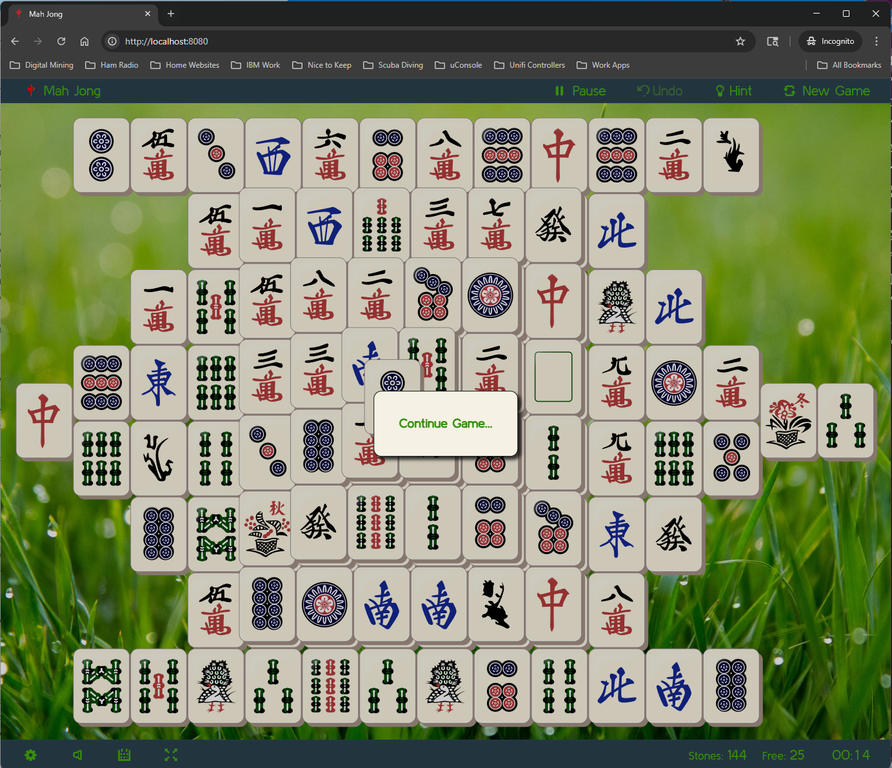

# Mahjong Web

A simple, clean, and high-performance Mahjong Solitaire web application, containerized for easy deployment.



## Features

- **Streamlined Experience**: No welcome screens or mandatory tutorials. Jump straight into the game.
- **Select Board**: Choose from a variety of traditional and custom layouts.
- **Visual Customization**: Toggle between different high-quality tilesets and background images.
- **Performance Focused**: Built with Angular for a smooth, responsive SPA experience.
- **Docker Ready**: Deploy anywhere using Docker and Nginx.
- **Sound & Music**: Relaxing audio effects and music (can be toggled in settings).
- **Statistics**: Tracks your wins, losses, and best times for each layout.

## Quick Start (Docker)

To run Mahjong Web locally using Docker Compose:

1. Clone the repository:
   ```bash
   git clone https://github.com/downing-labs/mahjong_web.git
   cd mahjong_web
   ```

2. Start the application:
   ```bash
   docker compose up --build -d
   ```

3. Open your browser and navigate to `http://localhost:8080`.

## Configuration

The application is served via Nginx on port 80 inside the container, mapped to port 8080 by default in `compose.yml`.

## Technical Stack

- **Frontend**: Angular (TypeScript)
- **Server**: Nginx (Alpine)
- **Deployment**: Docker Compose

## License

This project is licensed under the MIT License.

### Credits
This is a fork of the original [mah](https://github.com/ffalt/mah) project by ffalt. We've simplified the interface, removed non-web distribution logic, and streamlined the assets for a focused web-first experience.
